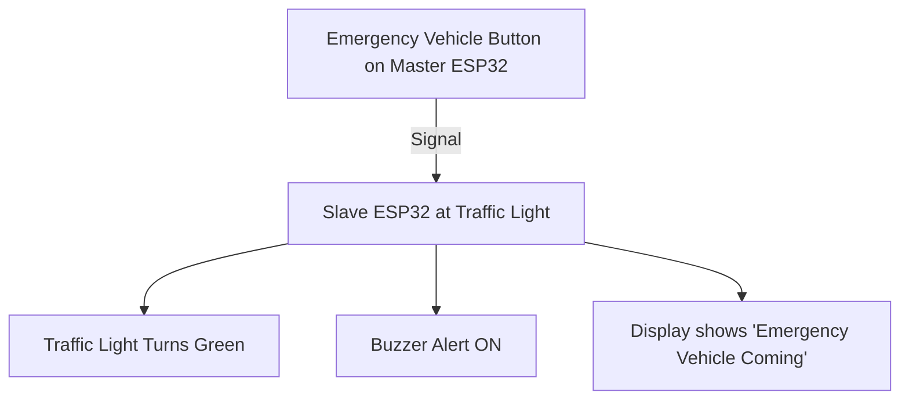

# 🚨 Emergency Vehicle Road Clearance System  

This project was developed for the **Plaksha University Competition** to solve the problem of emergency vehicles (ambulances, fire trucks, police) getting stuck in traffic.  
It uses **ESP32 microcontrollers** to control **traffic lights** and clear the road in advance for emergency vehicles.
---

## 🎥 Project Demo  

👉 [Watch Problem Video](https://drive.google.com/file/d/1_myjQqI6oWM2gIQ8SfEeol_685S-n0RG/view?usp=drive_link)

## 🚀 Features  

- Automatically detects approaching emergency vehicles.  
- Clears the road by turning traffic signals **green** in their path.  
- Uses **two ESP32 boards**:  
  - **Master ESP32** → placed inside the emergency vehicle.  
  - **Slave ESP32** → connected to traffic light systems at intersections.  
- Wireless communication between master and slave.  
- Display + buzzer alerts for nearby drivers.  

---

## ⚡ Hardware Components  

- 2 × ESP32 (Master + Slave)  
- 1 × Buzzer module  
- 16 × Traffic light module (LEDs or relay-controlled signals)  
- 2 × I2C Display (16x2 LCD or OLED)  
- 2 × Ultra Sonic Sensors 
- Breadboard, jumper wires, power supply  

---

## 🔌 Wiring & Flow Diagram  

### 🔹 Master ESP32 (Inside Emergency Vehicle)  
- Sends a signal when the vehicle is on duty.  
- Can be triggered manually or automatically.  

### 🔹 Slave ESP32 (At Traffic Intersection)  
- Receives signal from Master ESP32.  
- Turns traffic lights **green** on the emergency lane.  
- Activates **buzzer + display warning** for nearby vehicles.  



---

## 📂 Project Structure  

```
├── masterESP32.ino   # Code for Master ESP32 (inside emergency vehicle)
├── slaveESP32.ino    # Code for Slave ESP32 (at traffic light)
├── README.md         # Documentation
```

---

## ⚙️ Setup Instructions  

1. **Upload the Code**  
   - Open `masterESP32.ino` and `slaveESP32.ino` in Arduino IDE.  
   - Install required ESP32 board support.  
   - Upload `masterESP32.ino` to the ESP32 inside the vehicle.  
   - Upload `slaveESP32.ino` to the ESP32 at the traffic light.  

2. **Wiring**  
   - Connect LEDs (Red, Yellow, Green) to the slave ESP32 pins.  
   - Connect a buzzer to an output pin.  
   - Connect an I2C Display to show alerts.  

3. **Operation**  
   - When the emergency vehicle is active, the Master ESP32 sends a wireless signal.  
   - The Slave ESP32 switches traffic lights to green and alerts nearby drivers.  

---

## 📸 Model Prototype  


)  

---

## 📸 Team 


)  

---

## 👨‍💻 Authors  

Developed by **Suraj Gola & Team** 🚀  
- Team Leader: Suraj Gola  
- Hardware Specialists, Researcher, Art & Craft Manager, Public Speaking Support (6 members total)  

---

## 🛡️ License  

This project is licensed under the **MIT License** – feel free to use, modify, and share.  
